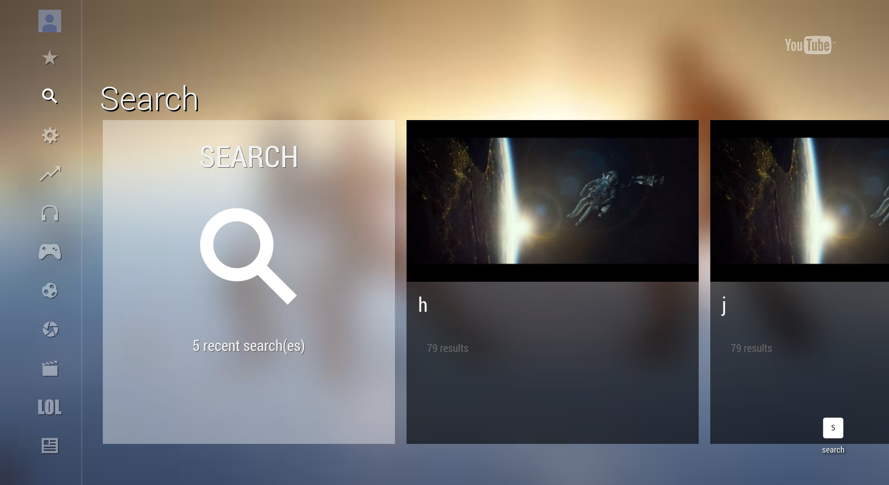
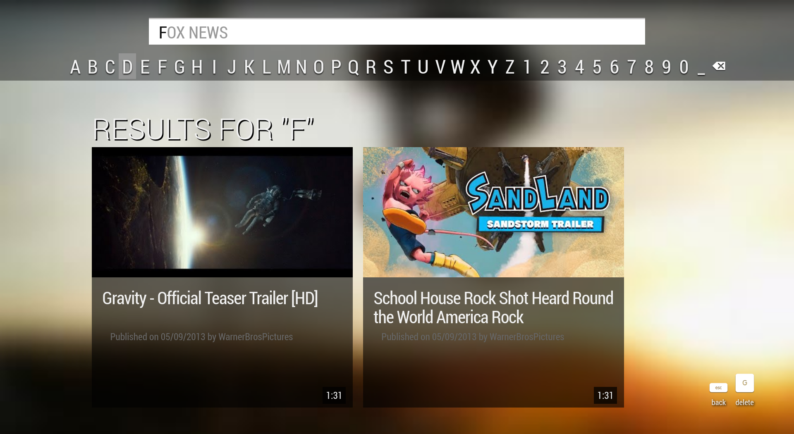
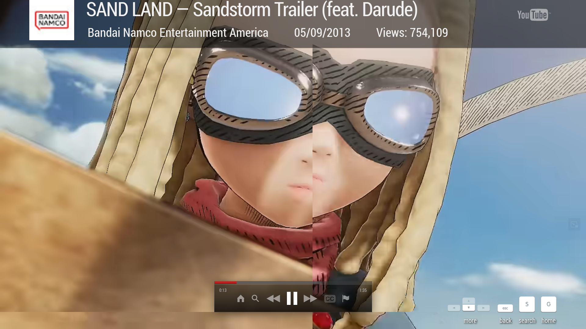
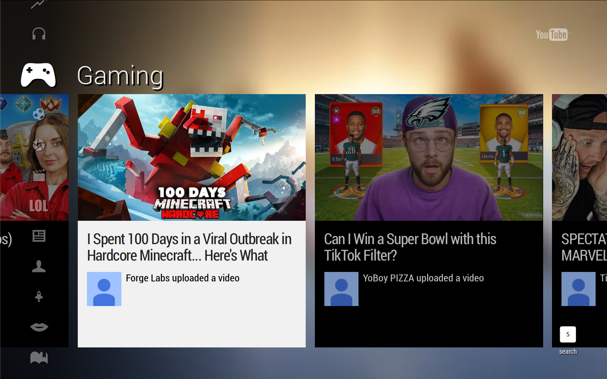

# 2013YouTubeTV

A project to revive the old 2012-2014 YouTubeTV HTML5 Web App.

## Screenshots

**[Note These Are As Of The 11th Of February At 2:15 EST, Things Will Have Changed]**

## Credits

- YouTube/Google

- Erie Valley Software/Erievs

- youtube-dl-exec [https://github.com/microlinkhq/youtube-dl-exec] 

- cors-anywhere [https://github.com/Rob--W/cors-anywhere?tab=readme-ov-file]

- youtubei [https://github.com/LuanRT/YouTube.js]

- qr-code [https://www.npmjs.com/package/qrcode]

- dx for his knowlage 

- Retrofoxxo for his private exsiting project which has a lot of the data I needed.

## Before Posting An Issue!

- Do not hide your damn local ip adress, I have no idea why SO many people
do not know that a 192.168.1.blank or equivlient is not your public IP. I
cannot help you if you're hiding part of your screen.

- Do not report an issue if you modified the port or adress you're hosting this on
, you're on your own if you wanna host it on a different port.

## If You're Going To Host This

PLEASE disable Oauth, so just delete refrences to it in server.js, why 
because this is designed for someone to host themeselves and only themeselves
so I save your token/refresh token in a .json file.

## Cool Things To Know

[WIP]

## Why We Use "youtube-dl-exec"

This is so we can get video urls, without having to deal with all the chiper bs you have
to deal with no  ** you will now need python3.7 or higher installed! though **

## Why We Use "qr-code"

Just to make qr codes for the google chart api implementation.

## Why We Use "youtubei"

It is to make my life easier, 2016YouTube doesn't use it as it formats the JSON from the InnerTube API direct
as in some cases it is pretty close to the data it wants, but this uses GDATA for a lot of parts and it's just 
eaiser to prase this way. 

## Why We Use "cors-anywhere"

YouTube has CORS on their googlevideo links (I forgot which settings) and it will 
give a CORS error if you try to get it, luckly this exsits so googlevideo links
are all going to be filtered through port 8070!

## Info On Hosting

Right now we use localhost, I think I will change this at some point when I am done 
with finishing the app. Probbaly what YT2009 does, where you input your IP adress you
wanna use. 

I mean YOU can now but you'll have to modify each refrence of localhost to your IP adress,
I just used localhsot as it was easy to setup.

Disable Oauth for now, you won't need to in the future since i can just get your access 
token from the headers (I didn't think about that).

We Use:

- Port 8090

- Port 8070 

## Supported YouTube TV Clients

We only offically supprort 4.20130311 as of right now, however it seems like 2012 builds
should run fine

## Setup

**[Note This Project Isn't Done, So Guide Won't Be Super Great]**

[Make sure you have nodejs, npm, and python3 (version 3.7.something or above!)]

- Step 1: run git clone https://github.com/erievs/2013YouTubeTV.git

- Step 2: run npm install

- Step 3: if you run into issues with youtube-exec, try running "npm install youtube-dl-exec --save"

- Step 4: if you want to set a custom server adress, such as your local ip adress, run 2013youtubesetup.js (it is in the root of the project), it'll display it for you.

- Step 5: run npm start, and you're done!

[When I say V, I mean the version of the YouTube App]

[Note this is not super accurate as I sometimes forget to 
change it, and this is copied and changed from 2016YouTubeTV]

Progress Report

1. Search - 55% Done

    Status: Currently static.
    Next Steps: Fetch data from InnnerTube.

3. Browse/Channels/Stantered Feeds/ - 40% Done

    Status: Around half the statndered feeds are done (some need to find the right 
    browseId, and some need to be added to the list), I also need to work on user feeds as well.
    Next Steps: Implement /user/, finish feeds.

4a. Watch - 65% Done

    Status: Playing videos and gets the data it needs for the info..
    Next Steps: Implemete realated videos feed.

4b. Watch Interactions - 0% Done

    Status: Nothing.
    Next Steps: Get it working.

5. Pairing - 0% Done

    Status: None.
    Next Steps: Get it working.

6. Sign In - 20% Done

    Status: Currently gets a code.
    Next Steps: Figure out why the /token is only getting called once (it needs to keep looking to work).

7. Assets - 80% Done

    Status: Should have most of em idk.
    Next Steps: Find missing assets and add them, also find as many BGs as I can find (rn we are at 45/115).

8. Other

- Support other versions of YouTube TV [In Progress]

- Other languages

- Fix grammar

